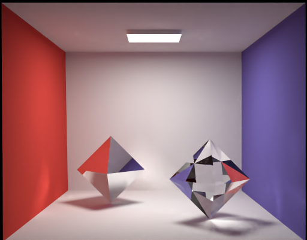
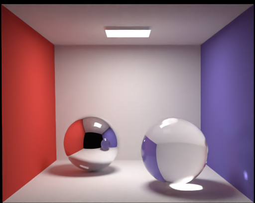

# GPU Renderer

  

## Tips

- If you haven’t written OOP program using CUDA and now you want to write a renderer using CUDA, I strongly recommend you learning Fermat’s structure before everything starts.  

- CUDA doesn’t support class inheritance, so try to define everything (i.e. material, shape) in some unified method as much as possible.    
- Ray query system roadmap : for loop -> recursive build and simple query BVH -> parallel build and simple query BVH -> parallel build and GPU-optimized query BVH.  
- If you don’t really care GUI, you can learning from CUDA’s SDK volumeRender.  
- Wavefront .obj scene (tiny_obj_loader), partly Mitsuba scene (XML) and custom scene format are easy to parse.  

## Reference

### System

[Fermat](https://nvlabs.github.io/fermat/) : CUDA renderer system 

[Megakernels Considered Harmful: Wavefront Path Tracing on GPU](https://research.nvidia.com/publication/megakernels-considered-harmful-wavefront-path-tracing-gpus) : Wavefront path tracer  

### BVH

[Maximizing Parallelism in the Construction of BVHs, Octrees, and k-d Tree](https://research.nvidia.com/publication/maximizing-parallelism-construction-bvhs-octrees-and-k-d-trees) : Parallel ontruct BVH using morton code  

[Understanding the Efficiency of Ray Traversal on GPUs](https://research.nvidia.com/publication/understanding-efficiency-ray-traversal-gpus) : Some implementation tricks on CUDA  

[GPU path tracing tutorial 3](http://raytracey.blogspot.com/2016/01/gpu-path-tracing-tutorial-3-take-your.html) : Some implementation tricks on CUDA  

## Selected images

