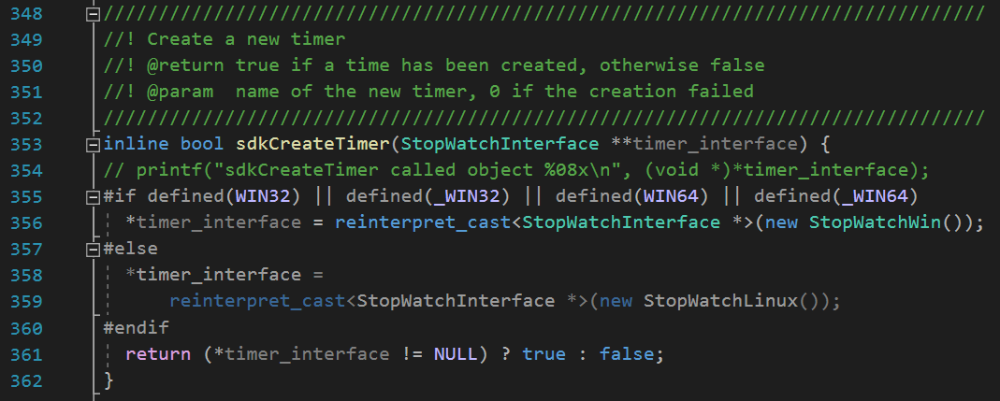

## 2019.11.28  
### CUDA Sampler/10.1/common/inc/timer.h
要求 :   
实现一个计时器，要求**跨平台**。  
实现 :   
1. 定义父类`StopWatchInterface`, 然后使用`StopWatchWin`和`StopWatchLinux`继承并实现父类中的虚函数。  
2. 然后定义`sdkCreateTimer`函数，根据平台决定使用哪种类型进行构造，最后使用`reinterpret_cast<StopWatchInterface *>()`进行强制转换。  
3. 利用是否定义`WIN32/_WIN32/WIN64/_WIN64`来判断是否为windows平台。  
 

PS : 声明实现分离, 主要是为了能够看清都声明了哪些函数, 之后查找较为方便。  

### CUDA与C++混合编译
要求 :   
在`c++`工程中调用CUDA函数。  
实现 :   
在`.cpp`文件中使用`extern "C"`前向声明要调用的CUDA函数, 然后在该CUDA函数的实现前也要加上`extern "C"`。  

## 2019.12.1  
### CUDA与OpenGL
要求 :   
CUDA与OpenGL交互
实现 :    
使用PBO得到  
```c++
GLuint pbo = 0;     // OpenGL pixel buffer object
GLuint tex = 0;     // OpenGL texture object
struct cudaGraphicsResource* cuda_pbo_resource; // CUDA Graphics Resource (to transfer PBO)

if (pbo)
{
    // unregister this buffer object from CUDA C
    checkCudaErrors(cudaGraphicsUnregisterResource(cuda_pbo_resource));
    // delete old buffer
    glDeleteBuffers(1, &pbo);
    glDeleteTextures(1, &tex);
}

// create pixel buffer object for display
glGenBuffers(1, &pbo);
glBindBuffer(GL_PIXEL_UNPACK_BUFFER_ARB, pbo);
glBufferData(GL_PIXEL_UNPACK_BUFFER_ARB, width * height * sizeof(GLubyte) * 4, 0, GL_STREAM_DRAW_ARB);
glBindBuffer(GL_PIXEL_UNPACK_BUFFER_ARB, 0);

// register this buffer object with CUDA
checkCudaErrors(cudaGraphicsGLRegisterBuffer(&cuda_pbo_resource, pbo, cudaGraphicsMapFlagsWriteDiscard));

// create texture for display
glGenTextures(1, &tex);
glBindTexture(GL_TEXTURE_2D, tex);
glTexImage2D(GL_TEXTURE_2D, 0, GL_RGBA8, width, height, 0, GL_RGBA, GL_UNSIGNED_BYTE, NULL);
glTexParameteri(GL_TEXTURE_2D, GL_TEXTURE_MIN_FILTER, GL_NEAREST);
glTexParameteri(GL_TEXTURE_2D, GL_TEXTURE_MAG_FILTER, GL_NEAREST);
glBindTexture(GL_TEXTURE_2D, 0);
```
注意，CUDA要引入`cuda_gl_interop.h`, 这里面会引入`GL/gl.h`, 而`GL/gl.h`要在先引入`windows.h`。  